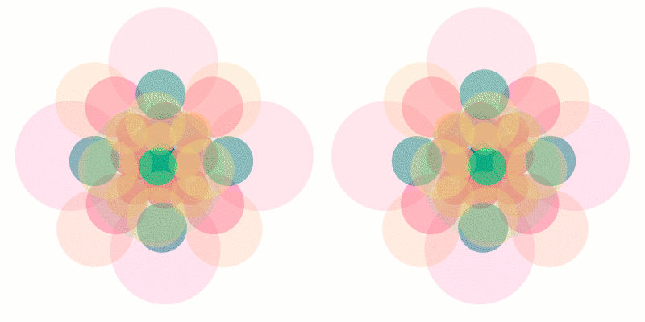

# 40-js

*An interactive 4D animation designed for cross-eye stereo viewing*

This is a pure JavaScript + Canvas experiment created for my 40th birthday - a fun deep dive into programming, geometry, and visual perception.

The animation displays 40 points arranged in 4D space (specifically, the centers of the 8 cells and 32 edges of a tesseract - 4D hypercube).  
These are projected into 3D, and shown as a pair of side-by-side views for cross-eye viewing, giving a stereoscopic effect.

Controls:
 * Mouse move – rotate the view
 * Left mouse drag - rotate the view
 * Mouse wheel – fly forward/backward in 4D
 * Right mouse drag
   - Horizontal – change circle size
   - Vertical – adjust transparency

Run the demo: [https://bntre.github.io/40-js/](https://bntre.github.io/40-js/)

